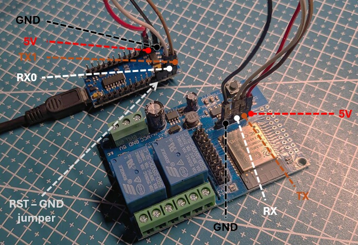

# Arduino Nano as a USB-to-TTL adapter to program your ESP32
Tested with ESP32 Relay X2 (ESP32-32E N4 chipe)

> **WARNING**
>
> The Arduino Nano may pass 5V instead of 3.3V to TX. Some ESP32 board can take it but to it at your own risk.

## Prepare boards
1. On Arduino, jump RESET (RST) and GND (to bypass CPU)
2. Connect the following:

| Arduino Nano pin | ESP32 Relay pin |
|---|---|
| 5V | VCC (or 5V input) |
| GND | GND |
| TX (Pin D1) | TX (or TXD) |
| RX (Pin D0) | RX (or RXD) |

