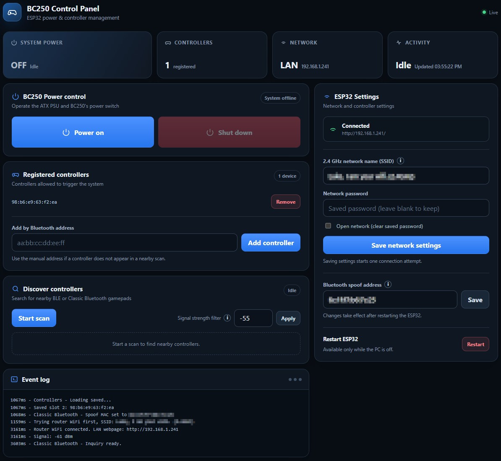
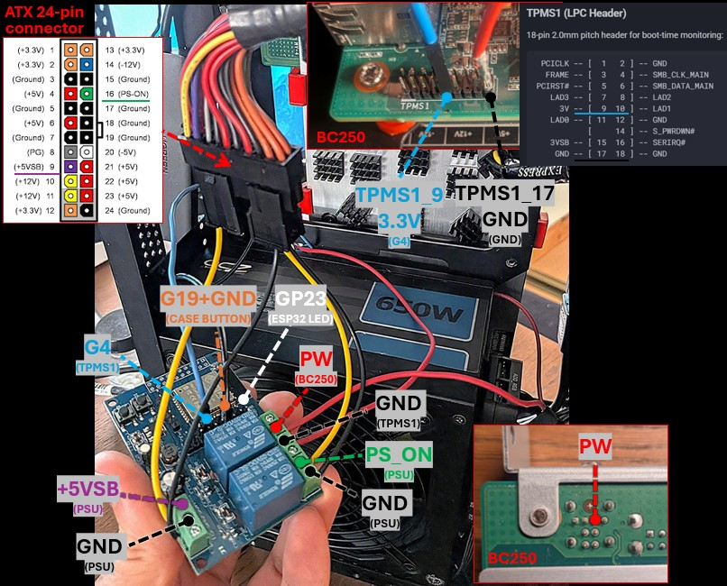
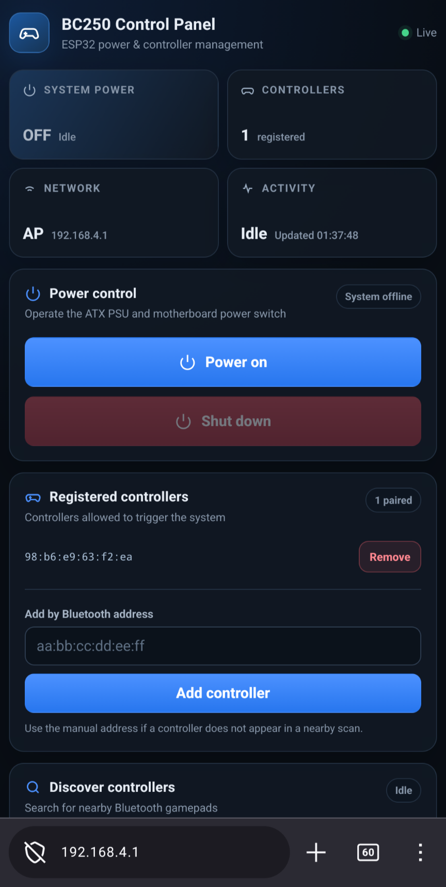

# BC250 Power Controller (ESP32 ATX PSU)



An ESP32-based power controller (with 2 relays) for a BC-250 motherboard running and controlling a standard ATX power supply. It lets a saved BLE or Bluetooth gamepad, a physical button, or a local web page start the system. It also coordinates the ATX `PS_ON` signal with the motherboard power-button input and monitors the PC's real power state for safer startup and shutdown handling.

> [!WARNING]
> This project switches PSU and motherboard control signals. Incorrect wiring can damage the ESP32, motherboard, or PSU. Disconnect mains power before changing wiring, verify every connection with a multimeter, and never feed 5 V or 12 V into an ESP32 GPIO. ATX supplies can retain hazardous energy after being unplugged.

## Features

- Provides physical-button power-on and normal-shutdown controls.
- Controls an ATX PSU and BC-250 motherboard on/off.
- Powers on the BC-250 when a registered gamepad is detected over BLE or Bluetooth Classic.
- Provides web-UI power control, live state, gamepad management, and a rolling event log.
- Supports optional password protection for the WebUI and HTTP API.
- Connects to a configured 2.4 GHz Wi-Fi network and falls back to its own setup access point if the connection fails.
- Saves router Wi-Fi settings from the web portal and applies them after a guarded controller restart.
- Discovers nearby gamepads from the built-in web-UI.
- Supports manual MAC-address registration when a gamepad is not discoverable.
- Supports persistent nicknames for registered controllers.
- Supports web-UI Android & iOS shortcut icons.
- Keeps the fallback AP active after a failed or dropped router connection; another router attempt is made only when settings are saved again or the ESP32 boots.
- Supports Bluetooth MAC address spoofing for Bluetooth Classic gamepads that are already paired with the BC250.

## How it works

The ESP32 remains powered from the ATX supply's always-on `+5VSB` rail. While the PC is off, it periodically scans for Bluetooth advertisements and inquiries from registered controllers.

When a known controller is detected, or power-on is requested from the button or web page, the controller:

1. Activates the PSU relay, connecting ATX `PS_ON` to ground.
2. Waits 1 second for the PSU rails to settle.
3. Activates the motherboard power-button relay for 500 ms.
4. Waits up to 15 seconds for the PC monitor input to go high.
5. Keeps `PS_ON` asserted while the PC is running.
6. Releases both relays if startup is not confirmed.

For a normal shutdown, it pulses the motherboard power-button input and leaves the PSU enabled while the operating system shuts down. Once the monitor input remains low and shutdown is confirmed, it releases `PS_ON`. Controller-triggered wake is ignored for 60 seconds after shutdown to avoid accidental wake loops.

## Hardware requirements

- An original ESP32 with Wi-Fi, BLE, and Bluetooth Classic support.
- A two-channel, ESP32-compatible relay board; the sketch is arranged for an active-high ESP32 Relay X2-style board.
- BC-250 motherboard and its power-button header/pads.
- Standard ATX PSU with accessible `+5VSB`, `PS_ON`, and ground connections.
- Momentary normally-open push button (PC Case button).
- LED with a suitable current-limiting resistor, unless the button assembly already includes one.
- Hook-up wire, insulated terminals/connectors, and suitable enclosure.
- Bluetooth controller whose address can be observed through BLE or Bluetooth Classic discovery (can also use [BluetoothViewer](https://www.nirsoft.net/utils/bluetooth_viewer.html)).

ESP32-C3 boards do not support Bluetooth Classic. Other ESP32 variants may also require changes to the Bluetooth APIs or pin assignments used by this sketch.

## Pin assignment & Wiring



| ESP32 pin | Sketch name |  | Connects to
| --- | --- | --- | --- |
| `GPIO 17` | `RELAY_PWR_PIN` | `BC25_PW` | Relay contact across the BC-250 power-button pins |
| `GPIO 16` | `RELAY_PSU_PIN` | `PS_ON` | Relay contact between ATX green `PS_ON` and PSU ground |
| `GPIO 19` | `BUTTON_PIN` | `Case_Button` | Physical button to ground |
| `GPIO 23` | `LED_PIN` | — | Status/button LED through a suitable resistor |
| `GPIO 4` | `PC_MONITOR_PIN` | `TPMS1_pin_9` | 3.3 V PC-on indication |
| `GND` | — | — | Button, LED, monitor-signal, and relay-board logic ground |

The labels “left relay” and “right relay” in the sketch refer to the author's relay board layout. Trust the GPIO numbers and verify your own board's relay mapping rather than relying only on physical position.

### ESP32 standby power

The ESP32 and relay logic must remain powered when the main ATX rails are off:

| ATX connection | Controller connection |
| --- | --- |
| Purple `+5VSB` | Relay-board/ESP32 VCC or 5V supply input appropriate for the board |
| Black ground | Relay-board/ESP32 `GND` |

Check the exact relay board documentation before applying power. A terminal labelled `5V` may be an output on some integrated ESP32 relay boards rather than the intended supply input.

### ATX PSU relay

Use the normally-open contacts of the relay controlled by `GPIO 16`:

- Relay `COM` to the ATX green `PS_ON` wire.
- Relay `NO` to an ATX black ground wire (`GND`).
- Leave `NC` unused.

### Motherboard power-button relay

Use the normally-open contacts of the relay controlled by `GPIO 17`:

- Relay `COM` to one BC-250 power-button contact.
- Relay `NO` to the BC-250 TPMS1 pin 17 (`GND`).
- Leave `NC` unused.

### Physical button and LED

- Connect a momentary button between `GPIO 19` and `GND`.
- If you have an external LED, connect it to `GPIO 23` using the correct polarity and a current-limiting resistor.

### PC-state monitor

- Connect the BC250 3.3V “PC on” signal to `GPIO 4`.

## Configure the sketch

Open [`BC250_ESP32_ATX_PSU.ino`](BC250_ESP32_ATX_PSU/BC250_ESP32_ATX_PSU.ino) and review the settings near the top before compiling.

### Wi-Fi and web portal

These values are the first-boot defaults. Saved values from the web portal take priority:

```cpp
const char* DEFAULT_WIFI_SSID = "YOUR_2_4_GHZ_WIFI";
const char* DEFAULT_WIFI_PASSWORD = "YOUR_WIFI_PASSWORD";
const char* WEB_HOSTNAME = "bc250-controller";
const char* WIFI_AP_PASSWORD = "CHOOSE_AN_8_PLUS_CHARACTER_PASSWORD";
```

- The ESP32 Wi-Fi radio uses 2.4 GHz; a 5 GHz-only network will not work.
- Set `DEFAULT_WIFI_SSID` to an empty string to start with the local setup AP. Router credentials can then be entered in the portal.
- Set `WIFI_AP_PASSWORD` to an empty string for an open AP, or use at least eight characters for a protected AP.
- Router SSID and password changes made in the portal are stored in the ESP32 `Preferences` namespace `wifi_cfg` and survive restarts and power loss.
- The portal never returns the saved password. A blank password field preserves it; select **Open network** to erase it deliberately.
- The fallback AP name and password remain compile-time settings.

Change the example fallback-AP password before flashing, or replace it with another password of at least eight characters. The portal also supports an optional WebUI password under **ESP32 Settings**. When enabled, the control panel and API require sign-in; passwords must be 8–64 characters and active sessions expire after eight hours of inactivity.

The server still uses plain HTTP rather than HTTPS, so credentials and commands are not encrypted in transit. Use it only on a trusted local network, choose strong AP and WebUI passwords, and do not expose port 80 to the internet.

### Pins and relay polarity

Change the five pin constants if your hardware is wired differently. The supplied configuration expects active-high relay inputs:

```cpp
const int RELAY_ON = HIGH;
const int RELAY_OFF = LOW;
```

Some relay modules are active-low. Confirm the idle state before connecting the relay contacts to the PC or PSU, then reverse these constants if required. Both relays must be released at boot.

### Timing and scan settings

The main adjustable values are:

| Setting | Default | Purpose |
| --- | ---: | --- |
| `WAKE_COOLDOWN_MS` | 15 s | Suppresses repeated wake requests after detection |
| `SHUTDOWN_COOLDOWN_MS` | 60 s | Blocks controller wake immediately after shutdown |
| `WEB_SCAN_DURATION_MS` | 15 s | Length of a controller scan started in the portal |
| `POWER_OFF_HOLD_MS` | 3 s | Physical-button hold required for shutdown |
| `PSU_SETTLE_BEFORE_PWR_SW_MS` | 1 s | Delay between `PS_ON` and motherboard button pulse |
| `POWER_BUTTON_PRESS_MS` | 500 ms | Motherboard button pulse length |
| `STARTUP_CONFIRM_TIMEOUT_MS` | 15 s | Maximum time to detect a successful startup |

## Compile and upload

If the ESP32 board has no onboard USB-to-serial interface, an Arduino Nano can be used as the programming adapter. See [Using an Arduino Nano as a USB-to-TTL adapter to program the ESP32](Arduino%20Nano%20as%20USB-to-TTL%20adapter%20to%20program%20ESP32.md) for the tested wiring, Arduino IDE procedure, bootloader-button sequence, and 3.3 V/5 V serial-level warning.

The WebUI is stored separately in LittleFS, so both the sketch and the `BC250_ESP32_ATX_PSU/data` directory must be uploaded.

Before proceeding, install the [`arduino-littlefs-upload`](https://github.com/earlephilhower/arduino-littlefs-upload/releases/latest) plugin for Arduino IDE 2:

1. Download the latest `.vsix` release.
2. Copy it to `~/.arduinoIDE/plugins/` on macOS/Linux or `%USERPROFILE%\.arduinoIDE\plugins\` on Windows.
3. Restart Arduino IDE.

Then flash the project:

1. Open `BC250_ESP32_ATX_PSU/BC250_ESP32_ATX_PSU.ino` in Arduino IDE
2. Select `board` > `Select other board and port` > `ESP32 Dev Module` and click `yes` in the notification to install
3. Select `Tools` > `Partition Scheme` > `No OTA (2MB APP/2MB SPIFFS)` (required due to the program size and WebUI filesystem)
4. Install an ESP32 LittleFS data-upload tool that supports Arduino IDE 2
5. Click the `verify` button (check icon) to test-compile the code
6. Go to `Tools` > `Port` and see what ports are shown up
7. Connect the ESP32 to your PC (i.e. ESP32 to the Arduino and then through USB)
8. Go to `Tools` > `Port` and select the new port that appeared
9. Click `upload` and wait for the compile to finish
10. When you see `Connecting` in the log, on ESP32 hold the `IOO` button, press the `EN` button once and then release the `IOO` button
11. Hit CTRL + SHIFT + P and find the `Upload LittleFS to Pico/ESP8266/ESP32`
12. When you see `Connecting` in the log, on ESP32 hold the `IOO` button, press the `EN` button once and then release the `IOO` button
13. The firmware and WebUI are now installed

Re-upload the LittleFS data whenever a file under `BC250_ESP32_ATX_PSU/data` changes.

## First-time setup

1. Power the ESP32 from a current-limited USB supply and test the button, LED, monitor input, and relay outputs without the PSU/motherboard control contacts attached.
2. Confirm relay polarity: both relays must be off immediately after reset when the PC monitor input is low.
3. Power the controller from ATX `+5VSB` and ground, still with the control contacts disconnected.
4. Watch Serial Monitor at `115200` baud for the assigned LAN address.
5. If router Wi-Fi fails after about 20 seconds, join the access point named by `WEB_HOSTNAME` (default: `bc250-controller`) and open `http://192.168.4.1/`.
6. Enter the 2.4 GHz router SSID and password under **Wi-Fi & device**, then select **Save Wi-Fi**.
7. While the PC state is off, select **Restart controller** to apply the saved settings. Reconnect through the new LAN address shown in Serial Monitor.
8. Under **ESP32 Settings**, enable a WebUI password and sign in again when prompted.
9. Register a controller using the portal.
10. Switch off and disconnect mains power, then wire the two relay contact pairs and PC monitor input.
11. Recheck continuity, isolation, GPIO voltage, and relay idle states before reconnecting mains.
12. Test web or physical-button power-on first, then test controller wake.
13. Start a normal OS shutdown and confirm that `PS_ON` remains active until the monitor signal goes low.

### Recommended Bluetooth Classic setup

For the best compatibility with Bluetooth Classic controllers, pair each controller with the BC250 first and confirm that it works normally in the BC250 operating system. A paired Classic controller may stop advertising itself as discoverable and instead try to reconnect directly to the Bluetooth adapter address it remembers.

After pairing, find the Bluetooth adapter MAC address on the BC250:

  ```bash
  bluetoothctl list
  ```

  Use the MAC address reported for the BC250 Bluetooth adapter or Bluetooth network connection.

In the ESP32 web interface, enter this address under **Bluetooth config** > **Bluetooth spoof address**, select **Save**, and restart the ESP32 while the BC250 is off. This is the BC250 adapter address, not the controller address. Each controller must still be added separately to the ESP32's **Registered controllers** list.

When the BC250 is off, the ESP32 temporarily uses the saved adapter address for Bluetooth Classic. This lets it detect a registered controller attempting to reconnect to the BC250 even when that controller is not discoverable through a normal inquiry. Once the BC250 turns on, the ESP32 stops answering under the spoofed address so the real BC250 Bluetooth adapter can take over. Leaving **Bluetooth spoof address** empty disables this behavior.

## Web interface



When connected to router Wi-Fi, open `http://bc250-controller.local/` or use the assigned local IP address instead.

If router Wi-Fi is unavailable, join the fallback AP and open `http://bc250-controller.local/` or `http://192.168.4.1/`.

The portal provides:

- Current PC state and internal power-operation state.
- A round power button that changes between power-on and shutdown according to the current PC state.
- The five saved-controller slots with removal controls.
- Optional persistent nicknames for saved controllers.
- A 15-second BLE/Bluetooth Classic scan for new devices.
- Persistent toggles for BLE, pairing-mode Bluetooth Classic, and spoof-address reconnect detection; all three default to enabled.
- Manual controller registration in `aa:bb:cc:dd:ee:ff` format.
- A dedicated **Bluetooth config** section containing the detection-method switches and persistent Bluetooth adapter spoof-address configuration.
- Persistent 2.4 GHz router SSID/password configuration.
- Optional WebUI/API password protection with sign-in and sign-out controls.
- A guarded ESP32 restart button, enabled only while the PC is off and the power state machine is idle.
- The latest 40 in-memory log lines.

The page refreshes approximately every 1.5 seconds. Logs are held only in RAM and are cleared when the ESP32 restarts.

## Register a controller

### Scan and pair

1. Put the controller into its Bluetooth pairing/discoverable mode and keep it close to the ESP32.
2. Open the web portal and select **Scan** under **Discover controllers**.
3. Wait for the controller to appear in the discovered list.
4. Select **Pair** next to the correct MAC address.
5. Shut the PC down, wait for the 60-second shutdown cooldown, and activate the controller.

The discovered list shows each device's RSSI as a reference, but scan results are not filtered by signal strength. Verify the controller name and MAC address before pairing it.

### Add a MAC address manually

Enter a known Bluetooth MAC address in the portal using colon-separated hexadecimal notation. You can assign an optional nickname while adding it and rename a saved controller later. Manual registration is useful when a controller does not advertise long enough to appear in a scan.

Controller addresses are stored in the ESP32 `Preferences` namespace `xbox_cfg` and survive power loss and firmware restarts. Adding a sixth unique controller replaces a slot using the sketch's rotating slot pointer. Controllers can be removed individually from the web page; there is currently no physical-button pairing or factory-reset gesture.

Some devices use private or rotating BLE addresses. Those devices may not wake reliably by a saved MAC address. Xbox controller behavior can also vary with controller model and firmware.

## Physical button and LED

| Input | Result |
| --- | --- |
| Short press while PC is off | Starts the ATX power-on sequence |
| Hold for at least 3 seconds while PC is on | Pulses the motherboard button for a normal shutdown |

The sketch performs two short LED blinks when accepting a short press or the long-press threshold. The LED toggles every 250 ms continuously; it is therefore best treated as an activity/heartbeat indicator rather than a direct PC-power indicator.

## Default behavior and safeguards

- PC-monitor changes must remain stable for 100 ms before they are accepted.
- Controller wake scanning runs only while the PC is off and at least one controller is saved.
- Normal controller wake is blocked for 60 seconds after the PC turns off.
- If PC-on confirmation is missing after 15 seconds, both relays are released.

## HTTP API

The WebUI uses a small form-encoded HTTP API. It can also be called by trusted local automation. `POST` fields belong in an `application/x-www-form-urlencoded` request body, not the URL query string.

When WebUI password protection is enabled, first call `/api/auth/login` and retain the returned `bc250_session` cookie. All other API routes require that cookie. Sessions expire after eight hours of inactivity, and repeated failed sign-ins trigger an increasing delay.

| Method | Path | Purpose |
| --- | --- | --- |
| `GET` | `/api/status` | PC, Wi-Fi, scan, and power-state status |
| `GET` | `/api/controllers` | Saved controller list |
| `GET` | `/api/found` | Current discovery results |
| `GET` | `/api/logs` | Rolling runtime log |
| `GET` | `/api/wifi` | Saved network, Bluetooth, scan, and WebUI-password status (never returns saved passwords) |
| `POST` | `/api/auth/login` | Sign in with `password`; this is the only API route available without a valid session when protection is enabled |
| `POST` | `/api/auth/logout` | Invalidate the current session |
| `POST` | `/api/auth/password` | Enable or change protection with `currentPassword` and `newPassword`, or disable it with `currentPassword` and `remove=1` |
| `POST` | `/api/power/on` | Request power-on |
| `POST` | `/api/power/off` | Request normal shutdown |
| `POST` | `/api/scan/start` | Start controller discovery |
| `POST` | `/api/scan/options` | Set `ble`, `inquiry`, and `paired` to `0` or `1` |
| `POST` | `/api/pair` | Save `mac` from the current discovery results |
| `POST` | `/api/manual-add` | Save `mac` manually with optional `name` |
| `POST` | `/api/nickname` | Set the optional `name` for zero-based `slot` |
| `POST` | `/api/remove` | Remove a zero-based `slot` |
| `POST` | `/api/wifi/save` | Save `ssid`, `password`, and `clearPassword`; a blank password preserves the current one unless `clearPassword=1` |
| `POST` | `/api/bluetooth/save` | Save the BC250 Bluetooth adapter spoof address as `mac`; a blank value disables spoofing after restart |
| `POST` | `/api/restart` | Restart the ESP32; rejected while the PC is on or power control is busy |

The server rejects unknown host names, cross-origin `POST` requests, oversized requests, and malformed headers. These checks and optional authentication reduce accidental or cross-site access, but they do not provide TLS or replace network isolation. Do not expose port 80 to the internet.

## Troubleshooting

### The web page is unavailable

- If the device responds with `WebUI filesystem is not available` or `Asset not found`, upload the `BC250_ESP32_ATX_PSU/data` directory to LittleFS using the same partition scheme used for the sketch.
- Confirm the configured network is 2.4 GHz and the SSID/password are correct.
- After the 20-second connection timeout, join the fallback AP and browse to `192.168.4.1`.
- Ensure the client is on the same LAN and that client/AP isolation is disabled.
- If `http://bc250-controller.local/` does not resolve, use the assigned local IP address.

### A controller is not found

- Confirm that the required detection method is enabled under **Bluetooth config**.
- Wait for the full 15-second scan because BLE and Classic inquiries share the radio.
- Read the controller MAC address elsewhere and add it manually.

### A saved controller does not wake the PC

- Wait at least 60 seconds after shutdown.
- Confirm the saved MAC matches the address the controller currently advertises.
- Add the BC250 Bluetooth adapter MAC address on the ESP32 WebUI to spoof its Bluetooth while BC250 is off.
